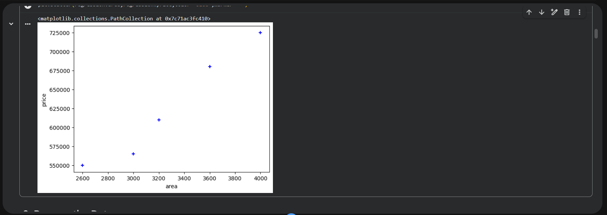
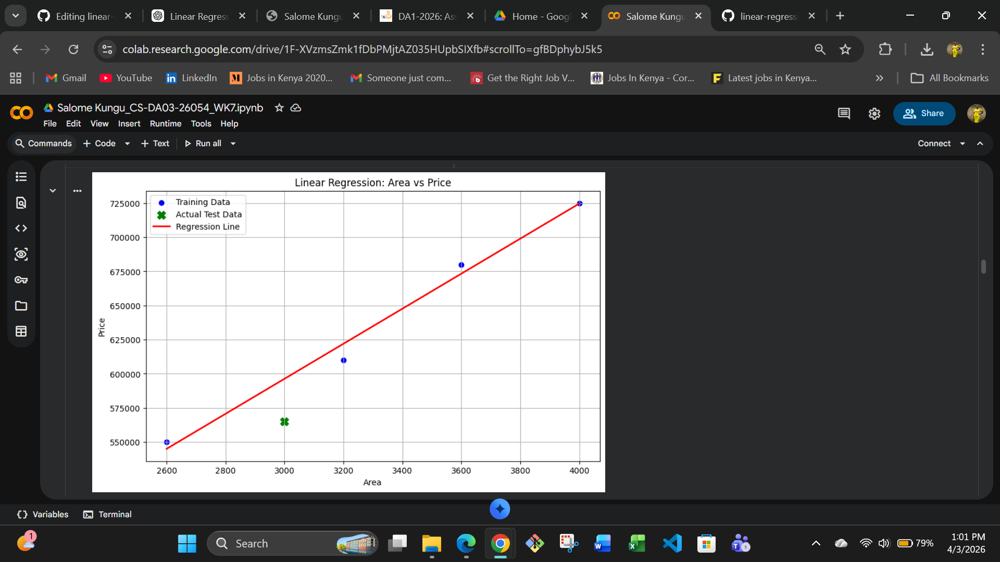
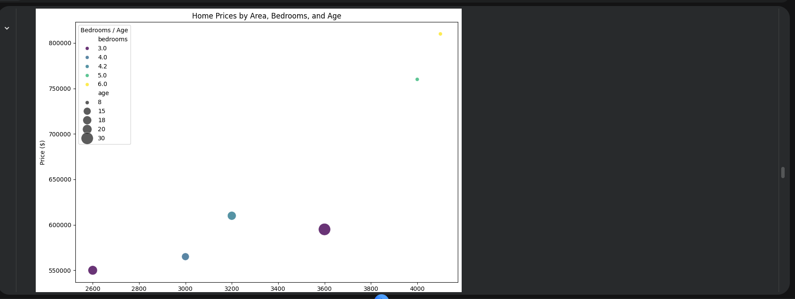

# Linear and Multiple Regression Analysis with Python

## Project Overview

This project demonstrates how to build, evaluate, and compare **Simple Linear Regression** and **Multiple Linear Regression (Multivariate Regression)** models using Python and Scikit-learn. The objective of the project is to predict a target variable using one feature in the simple regression model and multiple features in the multivariate regression model. The workflow covers the complete machine learning pipeline including data exploration, preprocessing, model training, evaluation, and visualization.
This project was completed as part of the **Cyber Shujaa Data and Artificial Intelligence Program** and serves as part of my data analytics and machine learning portfolio.

---

## Objectives

The key objectives of this project were to:

* Explore and understand the dataset
* Prepare and split data into training and testing sets
* Build a **Simple Linear Regression** model
* Build a **Multiple Linear Regression** model
* Evaluate model performance using standard regression metrics
* Visualize predictions and model behavior
* Compare the performance of the two regression approaches
* Publish the project as part of a professional portfolio

---

## Technologies Used

* Python
* Jupyter Notebook / Google Colab
* Pandas
* NumPy
* Matplotlib
* Seaborn
* Scikit-learn

## Machine Learning Workflow

The project follows a structured machine learning workflow:

### 1. Data Loading and Exploration

The dataset is loaded using **Pandas**, and initial exploration is performed using:

* `.head()`
* `.info()`
* `.describe()`

Visualizations such as scatter plots help identify relationships between variables.

---

### 2. Data Preparation

The dataset is prepared for modeling by:

* Checking for missing values
* Selecting relevant features
* Splitting the dataset into training and testing sets

The data is split using an **80/20 training/testing ratio**.

---

### 3. Simple Linear Regression

A **Simple Linear Regression model** is built using one independent variable.

This model learns the relationship between a single predictor and the target variable by fitting a straight regression line.

The regression equation takes the form:

```
y = β0 + β1x
```

Where:

* **β0** = intercept
* **β1** = coefficient (slope)

---

### 4. Multiple Linear Regression

A **Multiple Linear Regression model** is implemented using several independent variables.

This allows the model to capture the **combined influence of multiple predictors** on the target variable.

The regression equation becomes:

```
y = β0 + β1x1 + β2x2 + β3x3 + ...
```

This model generally improves predictive performance when relevant features are included.

---

### 5. Model Evaluation

Both regression models are evaluated using the following metrics:

| Metric   | Description                                            |
| -------- | ------------------------------------------------------ |
| MAE      | Mean Absolute Error – average prediction error         |
| MSE      | Mean Squared Error – penalizes larger errors           |
| RMSE     | Root Mean Squared Error – error in original unit scale |
| R² Score | Measures how well the model explains variance          |

These metrics help determine which model performs better.

---

### 6. Visualization

Visualizations are used to understand and validate model performance.

Examples include:

* Scatter plots of actual data



* Regression line plots (Simple Linear Regression)


 
* Actual vs Predicted plots (Multiple Regression)

 

These visualizations help confirm the model fit and detect prediction deviations.

---

## Model Comparison

After training and evaluating both models, their results are compared to determine which approach performs better.

In most cases, **Multiple Linear Regression provides better predictive accuracy** because it incorporates additional relevant variables.

---


## Example Results

The project generates:

* Model evaluation metrics
* Regression visualizations
* Model comparison analysis

These results help demonstrate how regression models can be used to make predictions from data.

---

## Key Learning Outcomes

Through this project, I gained practical experience in:

* Data exploration and preprocessing
* Implementing regression algorithms
* Evaluating machine learning models
* Visualizing predictive relationships
* Comparing baseline and improved models

